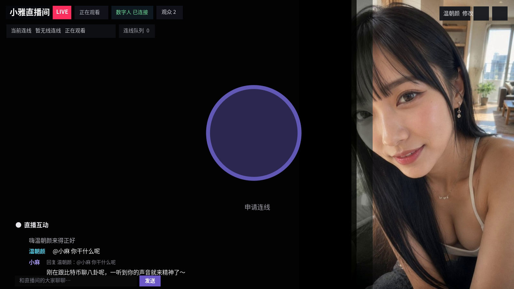
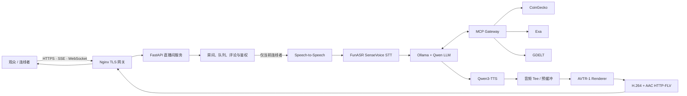

<div align="center">

# Cyber Girlfriend Live

### 本地部署的多人 AI 数字人直播间

让所有观众共享观看同一个数字人直播流，通过排队连线、实时评论和 `@小麻` 语音回复与她自然交流。

[](LICENSE)
[](https://www.python.org/)
[](https://developer.nvidia.com/cuda-toolkit)
[](third_party/avtr-1/README.md)
[](https://github.com/lonely1215225/cyber-girlfriend-live)

</div>



> 这不是只能由一个人使用的语音聊天 Demo，而是一套完整的直播间交互架构：共享数字人音画、多人在线、观众评论、连线排队、主动欢迎、空闲找话题、MCP 工具调用与双层会话记忆均由同一套服务协调。

## 功能亮点

| 能力 | 说明 |
| --- | --- |
| 共享数字人直播 | 所有观众观看同一路 AVTR-1 HTTP-FLV 流，视频、声音和口型共用封装时钟 |
| 多人在线房间 | 访客自动获得纯中文或纯英文随机名，可改名并查看当前在线观众 |
| 公平连线队列 | 同一时刻仅一位观众连线，其余申请 FIFO 排队；超时、掉线和主动下线自动释放席位 |
| 完整回复与手动打断 | 默认关闭自然语音打断，优先完整播放；数字人说话时点击中央圆圈仍可立即手动打断 |
| 沉浸式公屏 | 左下角无边框渐隐聊天，桌面端可展开，移动端默认只显示最近三条，减少画面遮挡 |
| `@小麻` 语音回复 | 无人连线时，公屏提及会进入独立 FIFO 队列，由数字人口播并展示引用关系 |
| 主动交互 | 连线成功主动欢迎；双方安静一段时间后，会主动询问近况或发起动漫、动物、音乐等话题 |
| MCP 工具 | 对话可调用 CoinGecko、Exa 与 GDELT，查询行情、网页内容和全球新闻 |
| 双层记忆 | 热上下文保留近期原文，旧内容先本地结构化压缩，再于空闲期异步进行语义整理 |
| 管理设置保护 | 右上角工具与设置需要密码解锁，带 HttpOnly 会话与失败频率限制 |
| 本地 AI 栈 | SenseVoice、Ollama/Qwen、Qwen3-TTS 和 AVTR-1 全部运行在自己的 GPU 服务器上 |

## 交互规则

系统始终按以下优先级调度语音，避免多路回复互相抢占：

```text
当前连线者实时对话
        ↓ 无人连线
@小麻 评论回复队列
        ↓ 队列为空
数字人空闲主动话题
```

- 连线者拥有最高优先级。有人获得或即将获得连线席位时，评论语音任务会暂停并重新排队。
- `@小麻` 回复按评论到达顺序串行播放，防止多人同时触发导致音画混乱。
- 普通评论只在公屏展示，不触发模型和语音。
- 默认不允许普通观众修改全局形象或绕过队列直连语音服务。

## 系统架构



音频不会在浏览器和数字人之间分别走两套播放器。TTS 音频进入 AVTR-1 后与视频一起封装为 HTTP-FLV，因此声音与口型使用同一个时间轴。网关同时生成“语音原轨”和“语音加背景音乐”两种时间戳一致的直播变体；每位观众可用 LIVE 旁的喇叭独立选择，关闭音乐不会影响数字人语音，也不会改变其他观众。根目录下的 MP3 作为纯音乐播放列表循环混入音乐变体；检测到数字人或连线用户说话时自动平滑降低音乐音量，音乐本身不会进入口型模型。`AVATAR_TEE_PREROLL_MS` 提供首包预缓冲，降低网络或推理抖动造成的半句丢失。

## 技术栈

- **Web / 房间服务：** FastAPI、Uvicorn、原生 JavaScript、SSE、WebSocket
- **公网入口：** Nginx、HTTPS、自签名证书
- **语音识别：** FunASR `SenseVoiceSmall` + Silero VAD（中/英/粤/日/韩）
- **大语言模型：** Ollama + `jaahas/qwen3.5-uncensored:9b`
- **语音合成：** Qwen3-TTS 1.7B，支持参考音频音色克隆
- **数字人渲染：** AVTR-1、TensorRT、H.264/AAC、HTTP-FLV
- **工具调用：** Streamable HTTP MCP（CoinGecko、Exa、GDELT）
- **运行环境：** Ubuntu、Python 3.12、CUDA 12.8、Pixi、uv

## 环境要求

推荐在独立 NVIDIA GPU 服务器部署。

| 项目 | 要求 |
| --- | --- |
| 操作系统 | Ubuntu 22.04 或更新版本 |
| 权限 | 安装阶段需要 `root` |
| GPU | NVIDIA Ampere 或更新架构；推荐 RTX 4090 / 24 GB 显存级别 |
| 驱动 | 可用的 NVIDIA 驱动；安装器按 CUDA 12.8 环境构建 AVTR-1 TensorRT 引擎 |
| 磁盘 | 建议预留约 80 GB，用于依赖、模型、缓存和 TensorRT 产物 |
| 网络 | 首次安装需要访问 Hugging Face、Ollama 模型仓库和系统软件源 |

> 首次安装耗时主要取决于模型下载速度和 TensorRT 引擎编译速度。不同 GPU 架构生成的 TensorRT 引擎不建议直接跨机器复制。

## 快速开始

### 1. 克隆项目

```bash
git clone git@github.com:lonely1215225/cyber-girlfriend-live.git
cd cyber-girlfriend-live
```

没有配置 GitHub SSH Key 时，也可以使用 HTTPS：

```bash
git clone https://github.com/lonely1215225/cyber-girlfriend-live.git
cd cyber-girlfriend-live
```

### 2. 安装

```bash
export PUBLIC_IP=你的公网IP        # 可选；不设置时自动探测
export HF_TOKEN=hf_xxx             # 仅在模型下载需要鉴权时设置
sudo -E ./install.sh
```

安装脚本会自动完成：

1. 安装系统依赖、uv、Pixi 与 Ollama；
2. 创建 Python 3.12 语音环境；
3. 下载 SenseVoiceSmall、Silero VAD、Qwen3-TTS 和 AVTR-1 权重；
4. 拉取默认 Qwen LLM；
5. 为当前 GPU 编译 AVTR-1 TensorRT 引擎；
6. 生成 `config.env` 与本地 HTTPS 证书。

### 3. 启动

```bash
./scripts/start.sh
```

浏览器访问 `https://你的公网IP:19800/`。首次访问需要接受自签名证书提示并允许浏览器使用麦克风。页面加载后即可观看直播；申请连线后，排到队首并确认即可开始语音交流。

### 4. 运维命令

```bash
./scripts/status.sh       # 查看各服务端口状态
./scripts/stop.sh         # 停止全部项目服务
./scripts/start.sh        # 重复执行可检查并补齐未运行服务
```

日志位于 `logs/`。项目会自动限制日志大小并保留上一段日志，避免长期运行耗尽磁盘。

## 配置说明

安装完成后修改根目录的 `config.env`，再重启服务使配置生效。完整默认值参见 [`config.env.example`](config.env.example)。

### 直播间与管理

| 参数 | 默认值 | 说明 |
| --- | ---: | --- |
| `LIVE_ROOM_ENABLED` | `1` | 开启多人直播间模式 |
| `LIVE_ROOM_QUEUE_LIMIT` | `100` | 连线排队人数上限 |
| `LIVE_ROOM_JOIN_TIMEOUT` | `60` | 队首获得席位后的确认时间，单位秒 |
| `LIVE_ROOM_MAX_CALL_SECONDS` | `600` | 单次连线最长时间，单位秒 |
| `MENTION_REPLY_QUEUE_LIMIT` | `30` | `@小麻` 待回复队列上限 |
| `ADMIN_SETTINGS_PASSWORD` | `123456` | 右上角工具与设置的初始密码，公网部署务必修改 |
| `ADMIN_SESSION_TTL_SECONDS` | `1800` | 管理解锁会话有效期，单位秒 |

### LLM 与双层记忆

| 参数 | 默认值 | 说明 |
| --- | ---: | --- |
| `LLM_NAME` | `jaahas/qwen3.5-uncensored:9b` | Ollama 模型名 |
| `LLM_NUM_CTX` | `4096` | 模型上下文窗口 token 数 |
| `LLM_NUM_PREDICT` | `128` | 普通回复最大生成 token 数 |
| `LLM_CHAT_SIZE` | `12` | 保留的近期用户轮次数 |
| `LLM_COMPACTION_MODE` | `local` | 第一层压缩模式；默认本地规则提取，不占用模型推理 |
| `LLM_COMPACTION_MAX_CHARS` | `900` | 本地结构化摘要最大字符数 |
| `MEMORY_SEMANTIC_ENABLED` | `1` | 开启第二层空闲语义整理 |
| `MEMORY_SEMANTIC_IDLE_SECONDS` | `12` | 安静多久后才开始语义整理 |
| `MEMORY_SEMANTIC_MAX_SECONDS` | `15` | 单次语义整理最长运行时间 |

第一层会从较早对话中提取身份、喜好、明确不喜欢的内容、重要事实、近期话题，以及数字人已作出的承诺和结论；最近一轮原文不会被压缩。第二层只在会话空闲时异步执行，用户一开口就立即取消，且仅当会话版本没有变化时才原子写回，所以不会阻塞当前回复或下一轮对话。

模型代理会流式移除 `<think>`、`<analysis>` 和 `<reasoning>` 等推理片段，避免它们出现在公屏或被 TTS 读出。每次连线的短期记忆相互隔离，房间重启后不会持久化。

### 语音、打断与数字人

| 参数 | 默认值 | 说明 |
| --- | ---: | --- |
| `STT_BACKEND` | `sensevoice` | 语音识别后端；可改为 `faster-whisper` 回退 |
| `SENSEVOICE_MODEL` | `models/sensevoice/SenseVoiceSmall` | SenseVoiceSmall 本地模型目录 |
| `FASTER_WHISPER_MODEL` | `large-v3` | 回退到 Faster-Whisper 时使用的模型 |
| `SENSEVOICE_LANGUAGE` | `auto` | 自动识别中/英/粤/日/韩；纯中文场景可设为 `zh` |
| `SENSEVOICE_USE_ITN` | `1` | 数字、日期等逆文本归一化 |
| `SENSEVOICE_EMOTION_ENABLED` | `1` | 将开心、难过、愤怒等声学情绪作为私有线索交给 LLM；不会显示在公屏 |
| `VAD_THRESH` | `0.6` | 语音活动检测阈值 |
| `MIN_SPEECH_MS` | `192` | 最短有效语音时长 |
| `MIN_SILENCE_MS` | `700` | 结束一句话所需静音时间 |
| `REOPEN_MS` | `1200` | 短暂停顿后重新合并窗口 |
| `QWEN3_TTS_CHUNK_SIZE` | `4` | TTS 流式分块大小 |
| `TTS_EMOTION_ENABLED` | `1` | 根据用户声学情绪和回复语义选择温柔、平静、轻快或沉稳语气 |
| `TTS_STYLE_INSTRUCT_ENABLED` | `1` | 向 Base 克隆模型发送逐句风格指令；关闭后仍保留文本停顿优化 |
| `TTS_TEMPERATURE` | `0.75` | TTS 采样温度；越低越稳定，过低可能偏平 |
| `TTS_TOP_K` | `40` | TTS Top-K 采样范围 |
| `TTS_TOP_P` | `0.90` | TTS 核采样范围 |
| `TTS_DO_SAMPLE` | `1` | 保留自然采样；设为 `0` 会更固定但可能更机械 |
| `TTS_REPETITION_PENALTY` | `1.05` | 声码重复惩罚 |
| `AVATAR_TEE_PREROLL_MS` | `400` | 数字人直播音频预缓冲时间 |
| `AVTR1_H264_BITRATE` | `900000` | 直播视频码率，带宽不足时可适当降低 |
| `AVTR1_CFG_SELF_AUDIO` | `2.3` | 说话动作的音频引导强度 |
| `AVTR1_CFG_OTHER_AUDIO` | `2.0` | 倾听动作的音频引导强度 |
| `AVTR1_CFG_KP` | `3.0` | 原始人物关键点与身份姿态约束；过高可能显得僵硬 |
| `AVTR1_NOISE_ALPHA` | `1.5` | 说话时随机运动的时间相关性，越高变化越连续 |
| `AVTR1_NOISE_TRUNC_Z` | `1.0` | 说话时随机运动幅度上限 |
| `AVTR1_IDLE_NOISE_ALPHA` | `10.0` | 静音动作时间相关性；默认采用更平滑的运动轨迹 |
| `AVTR1_IDLE_NOISE_TRUNC_Z` | `0.25` | 静音随机运动幅度上限，降低可抑制头部抖动 |
| `AVTR1_MOTION_AUDIO_RMS` | `80` | 进入说话动作模式的 PCM 音量阈值 |
| `AVTR1_MOTION_LISTEN_RMS` | `450` | 连线者触发倾听动作的 PCM 阈值，过滤静音底噪 |
| `AVTR1_MOTION_ACTIVE_HOLD_SECONDS` | `0.8` | 音频结束后保留说话动作参数的过渡时间 |
| `BACKGROUND_MUSIC_ENABLED` | `1` | 循环播放背景纯音乐 |
| `BACKGROUND_MUSIC_DIR` | `.` | MP3 播放列表目录；相对路径从项目根目录解析 |
| `BACKGROUND_MUSIC_VOLUME` | `0.16` | 无人说话时的背景音乐音量 |
| `BACKGROUND_MUSIC_DUCK_VOLUME` | `0.04` | 数字人或用户说话时的背景音乐音量 |
| `BACKGROUND_MUSIC_USER_RMS` | `450` | 触发用户说话闪避的麦克风 RMS 阈值 |

默认关闭自然语音打断，以保证长回复完整播放。数字人说话期间，当前连线者仍可点击页面中央圆圈手动打断；也可在管理员设置中打开自然打断。当前连线者的麦克风仅用于识别和驱动倾听动作，不会混入面向所有观众的直播声音。

TTS 默认只使用 `REF_AUDIO` 指向的一段小雅参考音频，不需要为不同观众或情绪准备额外录音。SenseVoice 的短期情绪只参与当前回复的语气规划：难过或哭声使用温柔安慰，生气使用平静语气，开心或笑声使用轻快语气；没有可靠声学线索时再根据回复文字判断。公屏仍展示 LLM 原文，TTS 会在自己的副本上规范省略号、补齐句末标点和必要停顿。Qwen3-TTS Base 的风格指令属于增强项，若某台机器上效果不稳定，可只设置 `TTS_STYLE_INSTRUCT_ENABLED=0`，无需关闭整套语气规划。

背景音乐由服务端一次解码，分别输出带音乐和不带音乐的 HTTP-FLV 音轨。把纯音乐 `.mp3` 放进 `BACKGROUND_MUSIC_DIR` 后重启服务即可加入播放列表；多首音乐会按文件名顺序播放，播完后从头循环。观众的开关偏好保存在自己的浏览器中，切换只会快速重连该观众的直播流。

### 主动欢迎与空闲话题

| 参数 | 默认值 | 说明 |
| --- | ---: | --- |
| `STARTUP_GREETING` | 内置提示词 | 连线确认后主动欢迎并询问一个简单问题 |
| `IDLE_PROMPT` | 内置提示词 | RSS 不可用时的主动话题降级提示 |
| `IDLE_PROMPT_MIN_SECONDS` | `35` | 最短空闲等待时间 |
| `IDLE_PROMPT_MAX_SECONDS` | `55` | 最长空闲等待时间 |
| `PROACTIVE_NEWS_MIN_SECONDS` | `90` | 无人连线时热点播报的最短间隔 |
| `PROACTIVE_NEWS_MAX_SECONDS` | `150` | 无人连线时热点播报的最长间隔 |

当前连线者持续安静达到随机等待时间后，浏览器会向受房间权限保护的接口请求一个主动话题。服务端从最新 RSS 热点中为该连线者轮换一条尚未讲过的新闻，把带来源和时间的资料注入当前对话，再由数字人用两到三句口语讲述并询问对方看法。新闻获取期间如果用户重新开口，本次主动播报会取消；RSS 不可用时才回退到 `IDLE_PROMPT` 的普通轻松话题。

无人连线、无人排队且没有待回复的 `@小麻` 评论时，服务端也会按较低频率轮换一条热点向全直播间主动播报。连线申请和评论回复始终拥有更高优先级，可以抢占尚未完成的主动播报。

## MCP 工具

涉及“最新新闻、当前价格、涨跌原因”的 `@小麻` 评论不会依赖小模型自行决定是否调用工具：后端会先并行查询价格与新闻，在评论区显示查询状态，再把有时间戳的结果交给模型生成可直接播报的最终答案。

新闻默认优先走无需 API Key 的本地 RSS 聚合层，包括 Google News 查询 RSS、UN News、Al Jazeera、NPR World 和 DW World。聚合器并行拉取 RSS/Atom，只保留标题、发布时间、简短摘要、来源和原文链接，按查询相关性与发布时间去重排序；不抓取或转载新闻全文。

| 服务 | 工具能力 | 默认地址 |
| --- | --- | --- |
| CoinGecko | 稳定币价查询、行情工具执行、文档检索 | `https://mcp.api.coingecko.com/mcp` |
| Exa | 网页搜索、正文抓取 | `https://mcp.exa.ai/mcp` |
| GDELT | 全球新闻检索 | `https://gdelt.caseyjhand.com/mcp` |
| Tavily（可选） | 搜索与正文提取 | 通过 `MCP_TAVILY_URL` 配置 |

完整新闻降级顺序为 RSS → Tavily（若配置）→ Exa → GDELT；价格和 MCP 新闻分别缓存 30 秒与 180 秒，RSS 查询缓存 120 秒，避免热门问题瞬间打满免费服务。可通过 `MCP_COINGECKO_URL`、`MCP_EXA_URL`、`MCP_GDELT_URL` 替换服务地址，或将带 API Key 的 Tavily MCP 地址填入 `MCP_TAVILY_URL`。单次工具结果默认限制为 `MCP_MAX_OUTPUT_CHARS=6000`，防止外部内容挤占全部模型上下文。

`NEWS_RSS_ENABLED` 和 `NEWS_GOOGLE_RSS_ENABLED` 可分别控制 RSS 聚合与查询型 RSS；默认只采用最近 168 小时的条目，可通过 `NEWS_RSS_MAX_AGE_HOURS` 调整。`NEWS_RSS_FEEDS` 可用 `来源名=https://...;来源名=https://...` 自定义订阅，并需在 `NEWS_RSS_ALLOWED_HOSTS` 中列出新增域名。RSS 只是信息入口，不等于内容没有版权；对外展示或商业使用时仍应保留来源署名并遵守各发布方条款。

`MENTION_RESEARCH_TIMEOUT` 控制单个研究工具超时，`MENTION_PRICE_CACHE_SECONDS` 和 `MENTION_NEWS_CACHE_SECONDS` 控制短缓存。来源失败时会继续尝试后备方案；所有来源都失败时，数字人会明确说明无法核实，不会用旧知识猜测实时事实。

只有当前连线者或被调度到的 `@小麻` 回复任务能够驱动工具调用；公开接口不能绕过房间权限直接替数字人调用工具。

## 默认形象与素材

默认数字人是 **小雅**，相关素材位于：

```text
assets/looks/xiaoya.png       # AVTR-1 默认参考形象
assets/avatars/xiaoya.jpg     # 兼容用形象素材
assets/looks/xiaoya_idle.png  # 从 idle.mp4 选取的暖光正脸形象
assets/ref16k.wav             # Qwen3-TTS 默认参考音色
```

其他内置形象也保存在 `assets/looks/`。管理员验证后可在设置顶部通过缩略图即时切换共享形象；其中“暖光正脸”取自 `assets/idle.mp4` 的清晰正脸帧。即使形象列表接口短暂失败，页面也会显示内置形象作为降级选项。这些默认形象不会被安装脚本或运行时清理；直播间中普通观众也不能修改全局形象。替换人物素材前，请确认你拥有相应图片、声音和肖像的合法使用授权。

## 项目结构

```text
cyber-girlfriend-live/
├── *.mp3                           # 共享直播背景纯音乐播放列表
├── assets/                         # 默认形象、背景与参考音色
├── docs/images/                    # README 演示素材
├── proxy/
│   ├── avtr1_gateway.py            # AVTR-1 会话、音画封装与 HTTP-FLV 网关
│   ├── s2s_with_avatar_tee.py      # TTS 音频分流、预缓冲与完整性控制
│   ├── ollama_thinkless.py         # Ollama Responses 兼容及推理标签过滤
│   ├── memory_compaction.py        # 本地结构化记忆压缩
│   ├── tiered_memory.py            # 双层异步记忆管理
│   └── nginx.conf.tpl              # 公网反向代理模板
├── s2s/hf-realtime-voice/
│   ├── server.py                   # FastAPI 页面、房间、鉴权与实时代理
│   ├── room_manager.py             # 在线观众、连线队列与租约状态机
│   ├── mention_reply.py            # @小麻 语音回复调度器
│   ├── mcp_gateway.py              # MCP 工具发现、调用与裁剪
│   ├── room.js                     # 直播间前端交互
│   └── index.html / style.css      # 响应式直播页面
├── third_party/avtr-1/             # AVTR-1 渲染器源码及独立许可文件
├── tests/                          # 房间、记忆、MCP、回复队列等单元测试
├── config.env.example              # 完整配置模板
├── install.sh                      # 新服务器一键安装
└── scripts/                        # 启动、停止、状态与发布脚本
```

模型权重、TensorRT 产物、虚拟环境、缓存、日志和 PID 文件不会进入 Git：

```text
models/  .cache/  logs/  run/  s2s/.venv/  third_party/avtr-1/artifacts/
```

当前运行链路只使用 AVTR-1，不依赖 Wav2Lip、MuseTalk 或 LiveTalking。

## 测试

完成安装后运行：

```bash
s2s/.venv/bin/python -m unittest discover -s tests -v
```

测试覆盖房间排队与掉线释放、身份鉴权、评论广播、`@小麻` 调度优先级、MCP 工具转换、思考标签清理、本地记忆压缩及异步语义写回保护。

## 常见问题

<details>
<summary><strong>声音先出来，口型随后才动怎么办？</strong></summary>

确认观众播放的是统一的 HTTP-FLV 流，而不是浏览器本地 TTS 音频；本项目默认已经使用统一音画链路。若服务器瞬时负载较高，可适当增大 `AVATAR_TEE_PREROLL_MS`，并检查 `logs/avatar_gw.log` 与 `logs/avtr1_renderer.log` 是否出现渲染积压。

</details>

<details>
<summary><strong>回复只播放了一半或像“丢包”怎么办？</strong></summary>

先保持自然打断关闭，排除麦克风回声误触发；再检查公网下行、GPU 利用率和网关日志。降低 `AVTR1_H264_BITRATE` 可以减少直播带宽，但语音文本缺失通常还需要检查 LLM/TTS 是否提前结束，而不能只归因于公网带宽。

</details>

<details>
<summary><strong>数字人偶尔张嘴幅度小怎么办？</strong></summary>

可小幅调整 `AVTR1_CFG_SELF_AUDIO` 与 `AVTR1_CFG_KP`。数值过高可能导致动作夸张或不稳定，建议每次只调整 10% 左右并观察完整句子的表现。网关会根据实时 PCM RMS 在说话与静音两套噪声参数间自动切换；静音稳定性主要由 `AVTR1_IDLE_NOISE_ALPHA` 和 `AVTR1_IDLE_NOISE_TRUNC_Z` 控制。`assets/looks/pasteback_mask_soft.png` 会作为每个内置形象的回贴蒙版，扩大头顶羽化区，减轻生成头部和原始图片之间的接缝。

</details>

<details>
<summary><strong>MCP 工具没有被调用怎么办？</strong></summary>

确认 `MCP_ENABLED=1`、服务器能访问对应 MCP 地址，并在管理员工具面板查看工具是否加载成功。模型只会在问题确实需要外部信息时调用工具，普通闲聊不会强制调用。

</details>

<details>
<summary><strong>浏览器提示证书不安全怎么办？</strong></summary>

默认安装生成自签名证书，首次访问需要手动信任。正式公网服务应在 Nginx 前配置可信域名证书，并只开放必要端口。

</details>

## 安全与生产部署

- **立即修改默认密码。** `ADMIN_SETTINGS_PASSWORD=123456` 只用于首次启动体验，不适合公网长期使用。
- `config.env`、证书私钥、日志和模型均已加入 `.gitignore`，不要手动提交这些内容。
- 管理会话使用 HttpOnly Cookie，并限制单位时间内的失败尝试；仍建议在公网入口增加防火墙、访问控制和速率限制。
- CoinGecko、Exa、GDELT 是远程 MCP 服务。启用后，工具查询内容会发送到相应第三方服务。
- 房间、排队、评论和短期记忆默认保存在当前进程内，适合单 Uvicorn worker 部署；进程重启会清空状态。多实例生产部署需接入 Redis 或其他共享状态后端。
- 请勿让服务处理未获授权的肖像、声音或受版权保护素材。

## 路线图

- [ ] Redis 房间状态与多实例水平扩展
- [ ] 管理员控制台与运行指标面板
- [ ] 可选的持久化用户记忆与隐私控制
- [ ] WebRTC / LL-HLS 等低延迟分发方案
- [ ] Docker / Compose 标准化部署
- [ ] 更多语言、音色与数字人预设

## 贡献

欢迎提交 Issue 与 Pull Request。建议在提交前：

1. 将改动控制在清晰、可复现的范围内；
2. 为房间状态、队列或记忆逻辑补充测试；
3. 不提交模型权重、运行日志、密钥、证书或本机构建产物；
4. 说明你的 GPU、驱动、操作系统和复现步骤。

## 开源许可

本项目自研代码采用 [MIT License](LICENSE)。`third_party/avtr-1/` 及其模型、渲染器、Streamer 和第三方组件受目录内各自的 `LICENSE*`、`PATENTS.md` 与 `THIRD-PARTY-NOTICES.md` 约束；使用或分发前请分别阅读。

---

<div align="center">

如果这个项目对你有帮助，欢迎点一个 Star，也欢迎一起把数字人直播做得更自然、更稳定。

</div>
