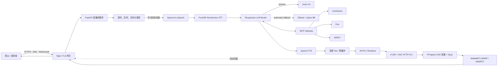

<div align="center">

# Cyber Girlfriend Live

### 本地部署的多人 AI 数字人直播间

让所有观众共享观看同一个数字人直播流，通过排队连线、实时评论和 `@小麻` 语音回复与她自然交流。

[](LICENSE)
[](https://www.python.org/)
[](https://developer.nvidia.com/cuda-toolkit)
[](third_party/avtr-1/README.md)
[](https://github.com/lonely1215225/cyber-girlfriend-live)

</div>


> 这不是只能由一个人使用的语音聊天 Demo，而是一套完整的直播间交互架构：共享数字人音画、多人在线、观众评论、连线排队、主动欢迎、空闲找话题、MCP 工具调用与双层会话记忆均由同一套服务协调。

## 功能亮点

| 能力 | 说明 |
| --- | --- |
| 共享数字人直播 | WebRTC/WHEP 优先、HTTP-FLV 自动回退；视频、声音和口型始终共用封装时钟 |
| 多人在线房间 | 访客自动获得纯中文或纯英文随机名，可改名并查看当前在线观众 |
| 公平连线队列 | 同一时刻仅一位观众连线，其余申请 FIFO 排队；超时、掉线和主动下线自动释放席位 |
| 完整回复与手动打断 | 默认关闭自然语音打断，优先完整播放；数字人说话时点击中央圆圈仍可立即手动打断 |
| 沉浸式公屏 | 左下角无边框渐隐聊天，桌面端可展开，移动端默认只显示最近三条，减少画面遮挡 |
| `@小麻` 语音回复 | 无人连线时，公屏提及会进入独立 FIFO 队列，由数字人口播并展示引用关系 |
| 主动交互 | 连线成功主动欢迎；双方安静一段时间后，会主动询问近况或发起动漫、动物、音乐等话题 |
| MCP 工具 | 对话可调用 CoinGecko、Exa 与 GDELT，查询行情、网页内容和全球新闻 |
| 双层记忆 | 热上下文保留近期原文，旧内容先本地结构化压缩，再于空闲期异步进行语义整理 |
| 管理设置保护 | 右上角工具与设置需要密码解锁，带 HttpOnly 会话与失败频率限制 |
| 本地 AI 栈 | SenseVoice、Ollama/Qwen、Qwen3-TTS 和 AVTR-1 全部运行在自己的 GPU 服务器上 |

## 交互规则

系统始终按以下优先级调度语音，避免多路回复互相抢占：

```text
当前连线者实时对话
        ↓ 无人连线
@小麻 评论回复队列
        ↓ 队列为空
数字人空闲主动话题
```

- 连线者拥有最高优先级。有人获得或即将获得连线席位时，评论语音任务会暂停并重新排队。
- `@小麻` 回复按评论到达顺序串行播放，防止多人同时触发导致音画混乱。
- 普通评论只在公屏展示，不触发模型和语音。
- 默认不允许普通观众修改全局形象或绕过队列直连语音服务。

## 系统架构



音频不会在浏览器和数字人之间分别走两套播放器。TTS 音频进入 AVTR-1 后先与视频共用同一个封装时钟，再以 H.264 Baseline + Opus 发布到 MediaMTX。浏览器优先通过 WHEP 建立 WebRTC，使用 RTP 抖动缓冲、NACK、Opus FEC 和弱网统计；协商或 ICE 失败时自动回退到原有 HTTP-FLV。网关同时生成“语音原轨”和“语音加背景音乐”两种时间戳一致的直播变体；每位观众可用 LIVE 旁的喇叭独立选择，关闭音乐不会影响数字人语音，也不会改变其他观众。`AVATAR_TEE_UPLOAD_PREROLL_MS` 控制上传到网关前的短缓冲，`AVTR1_OUTPUT_RESERVOIR_MS` 才是整轮首播水位；欠载后动态提高恢复水位，连续稳定时再逐步回落。AVTR 仍按五帧一批推理，但发布层固定输出 25 FPS；推理偶尔迟到时复用上一张原始帧补齐时间轴，不再向 WebRTC 发送断裂的视频节拍。

## 技术栈

- **Web / 房间服务：** FastAPI、Uvicorn、原生 JavaScript、SSE、WebSocket
- **公网入口：** Nginx、HTTPS、自签名证书
- **语音识别：** FunASR `SenseVoiceSmall` + Silero VAD（中/英/粤/日/韩）
- **大语言模型：** 可选 Grok 4.6 主模型 + Ollama `jaahas/qwen3.5-uncensored:9b` 自动降级
- **语音合成：** Qwen3-TTS 1.7B，支持参考音频音色克隆。IndexTTS-2.5 低延迟克隆实验已失败并移除：官方只有按句整段合成，没有可用的 token 级流式，首包延迟达不到陪伴对话要求。
- **数字人渲染与分发：** AVTR-1、TensorRT、H.264/Opus、MediaMTX WebRTC/WHEP、HTTP-FLV 回退
- **工具调用：** Streamable HTTP MCP（CoinGecko、Exa、GDELT）
- **运行环境：** Ubuntu、Python 3.12、CUDA 12.8、Pixi、uv

## 环境要求

推荐在独立 NVIDIA GPU 服务器部署。

| 项目 | 要求 |
| --- | --- |
| 操作系统 | Ubuntu 22.04 或更新版本 |
| 权限 | 安装阶段需要 `root` |
| GPU | NVIDIA Ampere 或更新架构；推荐 RTX 4090 / 24 GB 显存级别 |
| 驱动 | 可用的 NVIDIA 驱动；安装器按 CUDA 12.8 环境构建 AVTR-1 TensorRT 引擎 |
| 磁盘 | 建议预留约 80 GB，用于依赖、模型、缓存和 TensorRT 产物 |
| 网络 | 首次安装需要访问模型仓库；公网需开放 `19800/TCP`、`8189/UDP`，建议同时开放 `8190/TCP` |

> 首次安装耗时主要取决于模型下载速度和 TensorRT 引擎编译速度。不同 GPU 架构生成的 TensorRT 引擎不建议直接跨机器复制。

## 快速开始

### 1. 克隆项目

```bash
git clone git@github.com:lonely1215225/cyber-girlfriend-live.git
cd cyber-girlfriend-live
```

没有配置 GitHub SSH Key 时，也可以使用 HTTPS：

```bash
git clone https://github.com/lonely1215225/cyber-girlfriend-live.git
cd cyber-girlfriend-live
```

### 2. 安装

```bash
export PUBLIC_IP=你的公网IP        # 可选；不设置时自动探测
export HF_TOKEN=hf_xxx             # 仅在模型下载需要鉴权时设置
sudo -E ./install.sh
```

安装脚本会自动完成：

1. 安装系统依赖、uv、Pixi 与 Ollama；
2. 创建 Python 3.12 语音环境；
3. 下载 SenseVoiceSmall、Silero VAD、Qwen3-TTS 和 AVTR-1 权重；
4. 拉取默认 Qwen LLM；
5. 为当前 GPU 编译 AVTR-1 TensorRT 引擎；
6. 生成 `config.env` 与本地 HTTPS 证书。

### 3. 启动

```bash
./scripts/start.sh
```

浏览器访问 `https://你的公网IP:19800/`。首次访问需要接受自签名证书提示并允许浏览器使用麦克风。页面加载后即可观看直播；申请连线后，排到队首并确认即可开始语音交流。

WebRTC 媒体默认使用 `8189/UDP`，`8190/TCP` 是 UDP 被封时的次级 ICE 通道。Docker 部署必须同时发布这些端口，例如 `-p 19800:19800 -p 8189:8189/udp -p 8190:8190`；只发布网页端口时页面仍能打开，但播放器会自动退回 HTTP-FLV。

### 4. 运维命令

```bash
./scripts/status.sh       # 查看各服务端口状态
./scripts/stop.sh         # 停止全部项目服务
./scripts/start.sh        # 重复执行可检查并补齐未运行服务
```

日志位于 `logs/`。项目会自动限制日志大小并保留上一段日志，避免长期运行耗尽磁盘。

## 配置说明

安装完成后修改根目录的 `config.env`，再重启服务使配置生效。完整默认值参见 [`config.env.example`](config.env.example)。

### 直播间与管理

| 参数 | 默认值 | 说明 |
| --- | ---: | --- |
| `LIVE_ROOM_ENABLED` | `1` | 开启多人直播间模式 |
| `LIVE_ROOM_QUEUE_LIMIT` | `100` | 连线排队人数上限 |
| `LIVE_ROOM_JOIN_TIMEOUT` | `60` | 队首获得席位后的确认时间，单位秒 |
| `LIVE_ROOM_MAX_CALL_SECONDS` | `600` | 单次连线最长时间，单位秒 |
| `MENTION_REPLY_QUEUE_LIMIT` | `30` | `@小麻` 待回复队列上限 |
| `ADMIN_SETTINGS_PASSWORD` | `123456` | 右上角工具与设置的初始密码，公网部署务必修改 |
| `ADMIN_SESSION_TTL_SECONDS` | `1800` | 管理解锁会话有效期，单位秒 |
| `ROOM_DB_PATH` | `data/live_room.sqlite3` | 用户、浏览器会话、聊天、个人记忆和管理审计数据库 |
| `ROOM_IP_RETENTION_DAYS` | `30` | 用户 IP 访问记录保留天数 |

### LLM 与双层记忆

| 参数 | 默认值 | 说明 |
| --- | ---: | --- |
| `LLM_NAME` | `jaahas/qwen3.5-uncensored:9b` | Ollama 模型名 |
| `LLM_NUM_CTX` | `4096` | 模型上下文窗口 token 数 |
| `LLM_NUM_PREDICT` | `256` | 普通回复最大生成 token 数（含隐藏表演标签） |
| `LLM_NEWS_NUM_PREDICT` | `256` | 无人连线新闻播报的最大生成 token 数 |
| `LLM_LOCAL_CONVERSATION_NUM_PREDICT` | `160` | 本地闲聊/评论回复的最大生成 token 数 |
| `GROK_ENABLED` | `0` | 使用本机 Grok CLI OAuth 会话作为高质量主模型；异常时自动降级到 Ollama |
| `GROK_PROXY_BASE_URL` | `http://127.0.0.1:18080/v1` | 私有 Grok Responses 代理地址，只应监听 loopback |
| `GROK_MODEL` | `grok-4.6` | Grok 主模型名称 |
| `GROK_REASONING_EFFORT` | `low` | 实时直播工具循环的默认推理强度 |
| `GROK_MAX_CONCURRENCY_PER_ACCOUNT` | `2` | 同一订阅最多并行请求数；过程朗读和记忆压缩不会占用 Grok |
| `AGENT_TIMEZONE` | `Asia/Shanghai` | 传给模型的当前时间所属时区，供“今天、当前、最新”等问题使用 |
| `LLM_CHAT_SIZE` | `12` | 保留的近期用户轮次数 |
| `LLM_STREAM_BATCH_SENTENCES` | `1` | LLM 每生成一个完整中文句子就交给 TTS；不等待整段回复 |
| `LLM_LOCAL_READ_TIMEOUT_SECONDS` | `4.0` | 本地模型流连续无数据时的首响应保险丝；超时返回角色化中文短句，不等待外层 20 秒 |
| `LLM_COMPACTION_MODE` | `local` | 第一层压缩模式；默认本地规则提取，不占用模型推理 |
| `LLM_COMPACTION_MAX_CHARS` | `900` | 本地结构化摘要最大字符数 |
| `MEMORY_SEMANTIC_ENABLED` | `1` | 开启第二层空闲语义整理 |
| `MEMORY_SEMANTIC_IDLE_SECONDS` | `12` | 安静多久后才开始语义整理 |
| `MEMORY_SEMANTIC_MAX_SECONDS` | `15` | 单次语义整理最长运行时间 |

第一层会从较早对话中提取身份、喜好、明确不喜欢的内容、重要事实、近期话题，以及数字人已作出的承诺和结论；最近一轮原文不会被压缩。第二层只在会话空闲时异步执行，用户一开口就立即取消，且仅当会话版本没有变化时才原子写回，所以不会阻塞当前回复或下一轮对话。

模型代理会流式移除 `<think>`、`<analysis>` 和 `<reasoning>` 等推理片段，避免它们出现在公屏或被 TTS 读出。每次连线的短期记忆相互隔离，避免不同观众之间串线。

说话表情和 TTS 语气不使用中文关键词表。当前同一次 LLM 回答会先生成一个紧凑的隐藏表演控制，依据完整上下文选择表情、强度和朗读风格；控制记录在进入公屏和 TTS 前移除，因此不会被展示或读出，也不需要增加第二次模型调用。程序只校验 AVTR 支持的表情类型、数值边界、平滑过渡和音频分段时序。模型没有及时给出合法控制时，首句仍立即使用自然中性动作开始播放，不会为了表情阻塞对话。

可选 Grok 链路使用官方 Grok CLI 完成设备授权，再由社区兼容代理把当前服务器上的 OAuth 会话转换为仅本机可访问的 Responses API。凭据和刷新状态必须放在项目目录之外并保持 `0600` 权限，不能提交 Git，也不能把代理端口暴露到公网。该方式依赖消费级订阅及非官方兼容层，适合自有账号的内部试用；公开、多租户或商业部署应优先使用 xAI 官方 API。启用前在服务器执行 `grok login --device-auth`，安装并审计兼容代理后设置 `GROK_ENABLED=1`。DNS、授权、额度、限流或上游 5xx 都会在回答开始前自动回退本地模型。

跨连线记忆保存在 SQLite：匿名观众由长期 HttpOnly 随机会话识别，改名结果、最终公屏消息和完整语音转写在服务重启后仍可恢复。程序会从用户自己说过的内容中提取称呼、喜好、不喜欢、所在地和身份等结构化事实，同时使用 SQLite FTS5 trigram 索引进行轻量 RAG 检索。连线时只注入该用户最近对话和结构化事实；`@小麻` 评论会根据当前问题检索该用户自己的相关历史。其他观众的记录不会进入个人记忆上下文，流式半句话也不会落库。

### 联网智能搜索

联网查询不再由关键词规则预判问题类型。模型会看到 CoinGecko、RSS、Tavily/Exa/SearXNG 与 Jina Reader 的能力说明，自主决定是否调用、调用顺序及是否继续读取网页正文；程序只负责权限、参数校验、并发、超时、结果裁剪和循环上限。

```dotenv
# 主搜索：每月 1000 免费 credits，无需信用卡
TAVILY_API_KEY=tvly-...

# 备用搜索：免费账户包含注册及每月赠送额度
EXA_API_KEY=...

# 网页正文提取；不填也可尝试 Jina 的低频匿名额度
JINA_API_KEY=jina_...

# 可选的自建 SearXNG，例如 http://127.0.0.1:8080
SEARXNG_URL=
```

| 参数 | 默认值 | 说明 |
| --- | ---: | --- |
| `TAVILY_API_KEY` | 空 | Tavily 主搜索 Key；申请地址：<https://app.tavily.com/> |
| `EXA_API_KEY` | 空 | Exa 备用搜索 Key；申请地址：<https://dashboard.exa.ai/api-keys> |
| `JINA_API_KEY` | 空 | Jina Reader Key；申请地址：<https://jina.ai/api-dashboard/key-manager> |
| `SEARXNG_URL` | 空 | 自建 SearXNG 根地址；为空时跳过 |
| `JINA_READER_ENABLED` | `1` | 是否允许读取搜索结果中的公开网页正文 |
| `SMART_SEARCH_TIMEOUT_SECONDS` | `5` | 单个搜索供应商的超时时间 |
| `SMART_SEARCH_CACHE_SECONDS` | `180` | 相同查询的结果缓存时间，减少免费额度消耗 |
| `SMART_SEARCH_COOLDOWN_SECONDS` | `60` | 同一供应商连续失败后的熔断时间 |

没有配置任何搜索 Key 时，项目仍能正常启动，并继续使用 RSS、CoinGecko 和已有 MCP。配置 Key 后运行 `./scripts/start.sh` 重启服务即可自动出现 `smart_web_search` 工具。Tavily 正常返回时不会再调用 Exa，避免一次提问同时消耗两家的免费额度；连续失败的来源会临时熔断并自动恢复。

在线状态、连线排队和未完成回复仍只保存在内存，因为这些状态在进程重启后已经失效。管理员解锁采用数据库中的随机独立会话，每个浏览器分别授权、分别过期和撤销；全局形象修改会写入审计日志。

### 语音、打断与数字人

| 参数 | 默认值 | 说明 |
| --- | ---: | --- |
| `STT_BACKEND` | `sensevoice` | 语音识别后端；可改为 `faster-whisper` 回退 |
| `SENSEVOICE_MODEL` | `models/sensevoice/SenseVoiceSmall` | SenseVoiceSmall 本地模型目录 |
| `FASTER_WHISPER_MODEL` | `large-v3` | 回退到 Faster-Whisper 时使用的模型 |
| `SENSEVOICE_LANGUAGE` | `auto` | 自动识别中/英/粤/日/韩；纯中文场景可设为 `zh` |
| `SENSEVOICE_USE_ITN` | `1` | 数字、日期等逆文本归一化 |
| `SENSEVOICE_EMOTION_ENABLED` | `1` | 将开心、难过、愤怒等声学情绪作为私有线索交给 LLM；不会显示在公屏 |
| `VAD_THRESH` | `0.6` | 语音活动检测阈值 |
| `MIN_SPEECH_MS` | `192` | 最短有效语音时长 |
| `MIN_SILENCE_MS` | `700` | 结束一句话所需静音时间 |
| `REOPEN_MS` | `1200` | 短暂停顿后重新合并窗口 |
| `QWEN3_TTS_CHUNK_SIZE` | `4` | TTS 流式分块大小 |
| `TTS_EMOTION_ENABLED` | `1` | 根据用户声学情绪和回复语义选择温柔、平静、轻快或沉稳语气 |
| `TTS_STYLE_INSTRUCT_ENABLED` | `1` | 向 Base 克隆模型发送逐句风格指令；关闭后仍保留文本停顿优化 |
| `TTS_PROSODY_ENABLED` | `1` | 为弱模型输出恢复称呼、转折、追问等自然口语停顿；只影响朗读，不改聊天文本 |
| `TTS_PROSODY_MAX_CLAUSE_CHARS` | `20` | 无标点中文短句的建议最长长度；只在安全语义边界分段 |
| `TTS_TEMPERATURE` | `0.65` | TTS 采样温度；收窄随机漂移，同时保留情绪变化 |
| `TTS_TOP_K` | `30` | TTS Top-K 采样范围 |
| `TTS_TOP_P` | `0.85` | TTS 核采样范围 |
| `TTS_DO_SAMPLE` | `1` | 保留自然采样；设为 `0` 会更固定但可能更机械 |
| `TTS_REPETITION_PENALTY` | `1.05` | 声码重复惩罚 |
| `AVATAR_TEE_UPLOAD_PREROLL_MS` | `320` | TTS 上传到网关前的短缓冲；真正开播水位看下面的 AVTR 输出水库 |
| `AVATAR_TEE_SEGMENT_GAP_MS` | `1200` | 一句结束后再等这么久才收尾，避免慢续写把口型切断 |
| `AVTR1_SPEECH_START_BUFFER_MS` | `600` | 网关开始对口型前至少攒这么多音频 |
| `AVTR1_AUDIO_REBUFFER_STEP_MS` | `200` | 一轮语音发生欠载后，动态恢复水位的递增步长 |
| `AVTR1_AUDIO_MAX_BUFFER_MS` | `1400` | 动态语音水位上限；连续稳定三轮后会逐步回落 |
| `AVTR1_OUTPUT_RESERVOIR_MS` | `800` | AVTR 渲染后的同步音画输出水位目标 |
| `AVTR1_MAX_SPEECH_SECONDS` | `90` | 单轮数字人音频安全上限；主动新闻整轮预生成后播放，避免长播报裁掉开头 |
| `AVTR1_H264_BITRATE` | `900000` | 直播视频码率，带宽不足时可适当降低 |
| `WEBRTC_ENABLED` | `1` | WebRTC/WHEP 主播放；关闭后只使用 HTTP-FLV |
| `WEBRTC_PUBLIC_HOST` | `PUBLIC_IP` | 写入 ICE candidate 的公网 IP 或域名 |
| `WEBRTC_UDP_PORT` | `8189` | 首选 UDP/ICE 媒体端口，必须在宿主机和安全组放行 |
| `WEBRTC_TCP_PORT` | `8190` | UDP 不可达时的 ICE/TCP 备用端口 |
| `WEBRTC_OPUS_BITRATE` | `48000` | 数字人单声道 Opus 码率 |
| `WEBRTC_PACKET_LOSS_PERCENT` | `5` | Opus 编码器预期丢包率，用于启用适量 in-band FEC |
| `AVTR1_CFG_SELF_AUDIO` | `2.3` | 说话动作的音频引导强度 |
| `AVTR1_CFG_OTHER_AUDIO` | `2.0` | 倾听动作的音频引导强度 |
| `AVTR1_CFG_KP` | `3.0` | 原始人物关键点与身份姿态约束；过高可能显得僵硬 |
| `AVTR1_NOISE_ALPHA` | `1.5` | 说话时随机运动的时间相关性，越高变化越连续 |
| `AVTR1_NOISE_TRUNC_Z` | `1.0` | 说话时随机运动幅度上限 |
| `AVTR1_IDLE_NOISE_ALPHA` | `2.0` | 静音动作时间相关性；恢复 AVTR-1 原生待机动态参数 |
| `AVTR1_IDLE_NOISE_TRUNC_Z` | `1.2` | 静音随机运动幅度上限；恢复 AVTR-1 原生待机动作幅度 |
| `AVTR1_MOTION_AUDIO_RMS` | `80` | 进入说话动作模式的 PCM 音量阈值 |
| `AVTR1_MOTION_LISTEN_RMS` | `450` | 连线者触发倾听动作的 PCM 阈值，过滤静音底噪 |
| `AVTR1_MOTION_ACTIVE_HOLD_SECONDS` | `1.0` | 音频结束后保留说话动作参数的过渡时间 |
| `AVTR1_BLINK_ENABLED` | `1` | 待机、倾听和说话时均启用自然眨眼 |
| `AVTR1_BLINK_MIN_SECONDS` | `2.4` | 两次眨眼间隔的下限 |
| `AVTR1_BLINK_MAX_SECONDS` | `6.8` | 两次眨眼间隔的上限；实际采用非均匀分布，避免节拍器感 |
| `AVTR1_BLINK_STRENGTH` | `1.08` | 眨眼闭合幅度；降低强度可减少机械式重眨 |
| `AVTR1_BLINK_SPEECH_STRENGTH` | `1.08` | 说话时独立的眨眼闭合幅度 |
| `AVTR1_BLINK_SPEECH_INTERVAL_SCALE` | `0.82` | 说话时的眨眼间隔倍率；低于 `1` 表示比待机更频繁 |
| `AVTR1_BLINK_DOUBLE_PROBABILITY` | `0.08` | 偶发连续眨眼概率 |
| `AVTR1_BLINK_PARTIAL_PROBABILITY` | `0.28` | 不完全闭眼的轻眨概率 |
| `AVTR1_IDLE_BREATH_ENABLED` | `1` | 待机时启用低频呼吸/重心微动，说话时平滑淡出 |
| `AVTR1_IDLE_BREATH_POSE_DEGREES` | `0.65` | 待机摆头基础幅度 |
| `AVTR1_IDLE_BREATH_PITCH_RATIO` | `0.08` | 上下点头比例；保持极低，避免画面上下浮动 |
| `AVTR1_IDLE_BREATH_YAW_RATIO` | `1.0` | 左右摆头比例；作为待机附加动作的主方向 |
| `AVTR1_IDLE_BREATH_ROLL_RATIO` | `-0.12` | 轻微侧倾比例，避免摆头像机械水平旋转 |
| `AVTR1_IDLE_BREATH_PRIMARY_SECONDS` | `4.0` | 一次主要呼吸起伏的周期 |
| `AVTR1_IDLE_BREATH_DRIFT_SECONDS` | `9.1` | 慢速重心漂移周期，与呼吸周期错开以避免循环感 |
| `AVTR1_IDLE_BREATH_DRIFT_MIX` | `0.30` | 慢速漂移在待机微动中的占比，范围 `0–0.5` |
| `AVTR1_IDLE_BREATH_FADE_IN_STEP` | `0.08` | 静音后每个渲染块的呼吸淡入步长 |
| `AVTR1_IDLE_BREATH_FADE_OUT_STEP` | `0.18` | 开始说话后每个渲染块的呼吸淡出步长 |
| `BACKGROUND_MUSIC_ENABLED` | `1` | 循环播放背景纯音乐 |
| `BACKGROUND_MUSIC_DIR` | `assets/music` | MP3 播放列表目录；相对路径从项目根目录解析 |
| `BACKGROUND_MUSIC_VOLUME` | `0.16` | 无人说话时的背景音乐音量 |
| `BACKGROUND_MUSIC_DUCK_VOLUME` | `0.04` | 数字人或用户说话时的背景音乐音量 |
| `BACKGROUND_MUSIC_USER_RMS` | `450` | 触发用户说话闪避的麦克风 RMS 阈值 |

管理员设置采用“基础设置 / 动作设置”两个标签页，动作页再区分待机与说话状态。每个形象是一套独立角色档案，分别保存画面大小和位置、待机/说话动作以及参考音色。所有调整均采用即时预览和后台自动保存：滑块停止操作约 450ms 后写入 SQLite，开关与音色选择立即写入；若数字人正在播放语音，任务会在本轮结束后自动重试。点击形象卡片会原子切换整套配置，正在回复时只保留最后一次待切换请求，并在当前语音完整播放、AVTR 缓冲排空后生效。页面范围与渲染器硬限制一致：附加摆头幅度 `0–0.8°`、各方向比例 `-1–1`、眨眼力度 `0–1.5`。公网 `/av/motion-config` 写入仍被 Nginx 禁止，只能通过已解锁的个人管理会话修改。

默认关闭自然语音打断，以保证长回复完整播放。数字人说话期间，当前连线者仍可点击页面中央圆圈手动打断；也可在管理员设置中打开自然打断。当前连线者的麦克风仅用于识别和驱动倾听动作，不会混入面向所有观众的直播声音。

TTS 首次启动会把 `REF_AUDIO` 和 `REF_TEXT` 注册为不可删除的系统默认音色。管理员可在独立的“音色管理”中上传或录制 3～30 秒参考音频，服务端会解码、裁剪首尾静音、响度归一化并检查无声与削波；没有填写参考文本时，会在直播空闲时复用已经加载的 SenseVoice 异步识别，管理员校正并确认逐字文本后才能绑定。音频存放在权限受限且不公开静态访问的 `data/voices/`，浏览器和会话只使用不可伪造的 `voice_asset:<uuid>` 令牌。Qwen3-TTS 每次合成前解析当前角色音色并复用参考特征缓存，因此角色切换不需要重新加载模型。SenseVoice 的短期情绪仍参与当前回复的语气规划；LLM 与 TTS 保持中文标点感知的句级流式管线。

背景音乐由服务端一次解码，分别输出带音乐和不带音乐的时间戳一致音轨；两者均发布为 WebRTC Opus，并保留 HTTP-FLV 版本。把纯音乐 `.mp3` 放进 `BACKGROUND_MUSIC_DIR` 后重启服务即可加入播放列表；多首音乐会按文件名顺序播放，播完后从头循环。观众的开关偏好保存在自己的浏览器中，切换只会快速重连该观众选择的音轨。

### 主动欢迎与空闲话题

| 参数 | 默认值 | 说明 |
| --- | ---: | --- |
| `STARTUP_GREETING` | 内置提示词 | 连线确认后主动欢迎并询问一个简单问题 |
| `IDLE_PROMPT` | 内置提示词 | RSS 不可用时的主动话题降级提示 |
| `IDLE_PROMPT_MIN_SECONDS` | `35` | 最短空闲等待时间 |
| `IDLE_PROMPT_MAX_SECONDS` | `55` | 最长空闲等待时间 |
| `PROACTIVE_NEWS_MIN_SECONDS` | `90` | 无人连线时热点播报的最短间隔 |
| `PROACTIVE_NEWS_MAX_SECONDS` | `150` | 无人连线时热点播报的最长间隔 |

当前连线者持续安静达到随机等待时间后，浏览器会向受房间权限保护的接口请求一个主动话题。服务端从最新 RSS 资讯池中按照“新闻 → 科技 → 知识”轮换一条尚未讲过的内容，把带来源和时间的资料注入当前对话，再由数字人用两到三句口语讲述并询问对方看法。每个直播间/连线者分别保留最近 96 条播报历史，优先播完候选池后才允许重复。新闻获取期间如果用户重新开口，本次主动播报会取消；RSS 不可用时才回退到 `IDLE_PROMPT` 的普通轻松话题。

无人连线、无人排队且没有待回复的 `@小麻` 评论时，服务端也会按较低频率轮换一条热点向全直播间主动播报。连线申请和评论回复始终拥有更高优先级，可以抢占尚未完成的主动播报。

## MCP 工具

`@小麻` 使用统一的模型原生工具循环，不再维护“价格、新闻、涨跌原因”等关键词路由。模型可连续进行最多三轮工具调用；同一轮的独立调用会并行执行，工具结果作为结构化观察返回给同一会话，再由模型决定继续查询还是给出答案。

主动话题默认使用无需 API Key 的中文 AnyFeeder RSS 池：新闻类包括 iDaily 每日环球视野、中国新闻网国际新闻、澎湃新闻和人民日报；科技类包括极客公园、cnBeta 和 IT之家；知识类使用知乎日报。固定源采用受控并发拉取，单源失败只跳过该源，不会拖垮整批播报。Google News 查询 RSS 仅用于观众主动提出的具体新闻检索，不参与日常主动话题池。聚合器只保留标题、发布时间、简短摘要、来源和原文链接，按相关性与发布时间去重排序；不抓取或转载新闻全文。

这套 RSS 池同时服务主动播报、评论区 `@小麻` 和连线语音。`local_rss_news` 作为本地函数工具向模型提供 `category`、`source`、`query` 和 `limit` 参数；类别和来源由模型根据完整对话选择，而不是由后端关键词替模型猜测。

工具真正开始执行时，直播间会显示并播放与工具能力对应的短进度反馈；如果模型已经主动说过自然反馈，只有实际调用超过 2.5 秒才追加一次。进度 TTS 与网络调用并行，不会先播完整句话再开始查询。工具返回后若模型仍只说“稍等、我再看看”，系统会要求它基于已返回资料立即完成回答；连续不完成则明确失败。任务状态继续写入 SQLite `agent_jobs`，连线开始时暂停并让出最高语音优先级。

| 服务 | 工具能力 | 默认地址 |
| --- | --- | --- |
| CoinGecko | 稳定币价查询、行情工具执行、文档检索 | `https://mcp.api.coingecko.com/mcp` |
| Exa | 网页搜索、正文抓取 | `https://mcp.exa.ai/mcp` |
| GDELT | 全球新闻检索 | `https://gdelt.caseyjhand.com/mcp` |
| Tavily（可选） | 搜索与正文提取 | 通过 `MCP_TAVILY_URL` 配置 |

模型可以在 RSS、智能搜索和网页读取之间自主选择；智能搜索内部支持 Tavily、Exa 与 SearXNG 的健康检查、短缓存和失败熔断。可通过 `MCP_COINGECKO_URL`、`MCP_EXA_URL`、`MCP_GDELT_URL` 替换服务地址。单次工具结果默认限制为 `MCP_MAX_OUTPUT_CHARS=6000`，防止外部内容挤占全部模型上下文。

`NEWS_RSS_ENABLED` 和 `NEWS_GOOGLE_RSS_ENABLED` 可分别控制 RSS 聚合与查询型 RSS；默认只采用最近 72 小时的条目，可通过 `NEWS_RSS_MAX_AGE_HOURS` 调整。`NEWS_RSS_FEEDS` 可用 `来源名=https://...;来源名=https://...` 自定义订阅，并需在 `NEWS_RSS_ALLOWED_HOSTS` 中列出新增域名。RSS 只是信息入口，不等于内容没有版权；对外展示或商业使用时仍应保留来源署名并遵守各发布方条款。

每个工具使用自身超时与缓存设置；来源失败信息会作为工具结果返回模型，由模型决定改用其他来源或明确说明无法核实。

只有当前连线者或被调度到的 `@小麻` 回复任务能够驱动工具调用；公开接口不能绕过房间权限直接替数字人调用工具。

## 默认形象与素材

默认数字人形象是 **白背心**（`xiaoya_locket`），形象列表中也固定排在第一位；相关素材位于：

```text
assets/looks/xiaoya.png       # AVTR-1 默认参考形象
assets/avatars/xiaoya.jpg     # 兼容用形象素材
assets/looks/xiaoya_idle.png  # 从 idle.mp4 选取的暖光正脸形象
assets/ref16k.wav             # 首次注册的 Qwen3-TTS 系统默认参考音色
```

其他内置形象也保存在 `assets/looks/`。管理员验证后可在设置顶部编辑并切换角色档案；其中“暖光正脸”取自 `assets/idle.mp4` 的清晰正脸帧。所有在线观众通过服务端事件同步当前角色，事件连接断开时自动轮询恢复。这些默认形象不会被安装脚本或运行时清理；直播间中普通观众也不能修改角色、动作或音色。替换人物或声音素材前，请确认你拥有相应图片、声音和肖像的合法使用授权。

## 项目结构

```text
cyber-girlfriend-live/
├── *.mp3                           # 共享直播背景纯音乐播放列表
├── assets/                         # 默认形象、背景与参考音色
├── docs/images/                    # README 演示素材
├── data/                           # 运行时 SQLite 用户与记忆数据库（不提交 Git）
├── deploy/
│   ├── nginx/nginx.conf.tpl        # 公网反向代理模板
│   └── mediamtx/mediamtx.yml.tpl   # WHEP、ICE 端口与只读直播路径配置
├── proxy/
│   ├── avtr1_gateway.py            # AVTR-1 会话、音画封装与 HTTP-FLV 网关
│   ├── s2s_with_avatar_tee.py      # TTS 音频分流、预缓冲与完整性控制
│   ├── ollama_thinkless.py         # Ollama Responses 兼容及推理标签过滤
│   ├── memory_compaction.py        # 本地结构化记忆压缩
│   └── tiered_memory.py            # 双层异步记忆管理
├── apps/web/
│   ├── server.py                   # FastAPI 页面、房间、鉴权与实时代理
│   ├── room_manager.py             # 在线观众、连线队列与租约状态机
│   ├── mention_reply.py            # @小麻 语音回复调度器
│   ├── mcp_gateway.py              # MCP 工具发现、调用与裁剪
│   ├── room.js                     # 直播间前端交互
│   └── index.html / style.css      # 响应式直播页面
├── third_party/avtr-1/             # AVTR-1 渲染器源码及独立许可文件
├── tests/                          # 房间、记忆、MCP、回复队列等单元测试
├── config.env.example              # 完整配置模板
├── install.sh                      # 新服务器一键安装
└── scripts/                        # 启动、停止、状态与发布脚本
```

模型权重、TensorRT 产物、虚拟环境、缓存、日志和 PID 文件不会进入 Git：

```text
models/  .cache/  logs/  run/  s2s/.venv/  third_party/avtr-1/artifacts/
```

当前运行链路只使用 AVTR-1，不依赖 Wav2Lip、MuseTalk 或 LiveTalking。

## 测试

完成安装后运行：

```bash
s2s/.venv/bin/python -m unittest discover -s tests -v
```

测试覆盖房间排队与掉线释放、身份鉴权、评论广播、`@小麻` 调度优先级、MCP 工具转换、思考标签清理、本地记忆压缩及异步语义写回保护。

## 常见问题

<details>
<summary><strong>声音先出来，口型随后才动怎么办？</strong></summary>

确认状态显示 WebRTC 或 HTTP-FLV 兼容模式，而不是浏览器本地 TTS 音频；两种模式均使用统一音画链路。若服务器瞬时负载较高，可适当增大 `AVTR1_OUTPUT_RESERVOIR_MS`，并检查 `logs/avatar_gw.log` 与 `logs/avtr1_renderer.log` 是否出现渲染积压。

</details>

<details>
<summary><strong>回复只播放了一半或像“丢包”怎么办？</strong></summary>

先查看左上角状态是否为“兼容模式”：若是，说明 WebRTC 协商或 ICE 不通，应检查 `8189/UDP`、`8190/TCP` 的宿主机映射和安全组。WebRTC 模式可在 `window.AVATAR_STREAM_STATS` 查看丢包率、抖动、RTT、隐藏音频样本和冻结次数。仍然卡顿时再检查 GPU 利用率和 AVTR 网关日志；WebRTC 无法修复服务端已经发生的推理或渲染停顿。

</details>

<details>
<summary><strong>数字人偶尔张嘴幅度小怎么办？</strong></summary>

可小幅调整 `AVTR1_CFG_SELF_AUDIO` 与 `AVTR1_CFG_KP`。数值过高可能导致动作夸张或不稳定，建议每次只调整 10% 左右并观察完整句子的表现。网关会根据实时 PCM RMS 在说话与静音两套噪声参数间自动切换；静音稳定性主要由 `AVTR1_IDLE_NOISE_ALPHA` 和 `AVTR1_IDLE_NOISE_TRUNC_Z` 控制。AVTR-1 官方的无音频模式只承诺随机微动作，并不保证每个参考形象都会眨眼，因此本项目额外从内置 idle 素材提取了可跨形象重定向的闭眼表达。眨眼采用逐帧的快闭慢开曲线，时长、幅度和间隔会变化，也会偶发轻眨及连眨；待机、倾听和说话阶段均可触发。静音时还会叠加两种不同周期组成的低频呼吸微动，并在开始说话时平滑淡出。`assets/looks/pasteback_mask_soft.png` 会作为每个内置形象的回贴蒙版，扩大头顶羽化区，减轻生成头部和原始图片之间的接缝。

</details>

<details>
<summary><strong>MCP 工具没有被调用怎么办？</strong></summary>

确认 `MCP_ENABLED=1`、服务器能访问对应 MCP 地址，并在管理员工具面板查看工具是否加载成功。模型只会在问题确实需要外部信息时调用工具，普通闲聊不会强制调用。

</details>

<details>
<summary><strong>浏览器提示证书不安全怎么办？</strong></summary>

默认安装生成自签名证书，首次访问需要手动信任。正式公网服务应在 Nginx 前配置可信域名证书，并只开放必要端口。

</details>

## 安全与生产部署

- **立即修改默认密码。** `ADMIN_SETTINGS_PASSWORD=123456` 只用于首次启动体验，不适合公网长期使用。
- `config.env`、证书私钥、日志和模型均已加入 `.gitignore`，不要手动提交这些内容。
- 管理会话使用 HttpOnly Cookie，并限制单位时间内的失败尝试；仍建议在公网入口增加防火墙、访问控制和速率限制。
- CoinGecko、Exa、GDELT 是远程 MCP 服务。启用后，工具查询内容会发送到相应第三方服务。
- 房间、排队、评论和短期记忆默认保存在当前进程内，适合单 Uvicorn worker 部署；进程重启会清空状态。多实例生产部署需接入 Redis 或其他共享状态后端。
- 请勿让服务处理未获授权的肖像、声音或受版权保护素材。

## 路线图

- [ ] Redis 房间状态与多实例水平扩展
- [ ] 管理员控制台与运行指标面板
- [ ] 可选的持久化用户记忆与隐私控制
- [x] WebRTC/WHEP 主播放、弱网指标与 HTTP-FLV 自动回退
- [ ] Docker / Compose 标准化部署
- [ ] 更多语言、音色与数字人预设

## 贡献

欢迎提交 Issue 与 Pull Request。建议在提交前：

1. 将改动控制在清晰、可复现的范围内；
2. 为房间状态、队列或记忆逻辑补充测试；
3. 不提交模型权重、运行日志、密钥、证书或本机构建产物；
4. 说明你的 GPU、驱动、操作系统和复现步骤。

## 开源许可

本项目自研代码采用 [MIT License](LICENSE)。`third_party/avtr-1/` 及其模型、渲染器、Streamer 和第三方组件受目录内各自的 `LICENSE*`、`PATENTS.md` 与 `THIRD-PARTY-NOTICES.md` 约束；使用或分发前请分别阅读。

---

<div align="center">

如果这个项目对你有帮助，欢迎点一个 Star，也欢迎一起把数字人直播做得更自然、更稳定。

</div>
